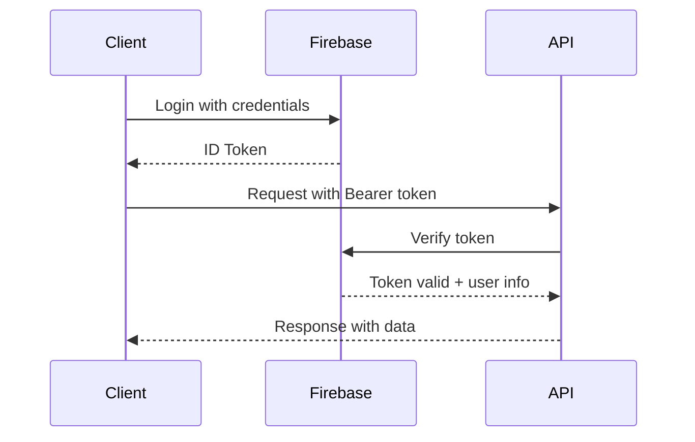

# Lumen API Documentation

# API Overview

The Lumen API is built with FastAPI and follows RESTful principles. All API interactions are documented in the sequence diagram [lumen-api-sequences.mmd](./lumen-api-sequences.mmd).

# Base URL

- **Development**: `http://localhost:8000/api/v1`
- **Production**: `https://lumen.photos/api/v1`

# Authentication

All protected endpoints require Firebase Authentication with JWT tokens.

# Authentication Flow



# Headers

```http
Authorization: Bearer <firebase_id_token>
Content-Type: application/json
```

# Endpoints

# Authentication

## GET /api/v1/auth/status
Verify current authentication status and get basic user info.

**Response:**
```json
{
  "authenticated": true,
  "uid": "firebase_uid_123",
  "email": "user@example.com",
  "email_verified": true,
  "display_name": "John Doe"
}
```

## GET /api/v1/auth/profile
Get current user's profile information (requires profile registration).

**Response:**
```json
{
  "uid": "firebase_uid_123",
  "email": "user@example.com",
  "display_name": "John Doe",
  "handle": "@johndoe",
  "user_type": "photographer",
  "bio": "Landscape photographer based in California",
  "profile_image_url": "https://example.com/image.jpg"
}
```

## POST /api/v1/auth/logout
Logout and invalidate session.

**Response:**
```json
{
  "message": "Successfully logged out"
}
```

## POST /api/v1/auth/register
Register a complete user profile after Firebase authentication.

**Request:**
```json
{
  "handle": "@johndoe",
  "display_name": "John Doe",
  "user_type": "photographer",
  "bio": "Landscape photographer",
  "city_id": 1,
  "photography_style": "landscape",
  "experience_level": "intermediate"
}
```

**Response:**
```json
{
  "uid": "firebase_uid_123",
  "handle": "@johndoe",
  "display_name": "John Doe",
  "user_type": "photographer",
  "created_at": "2025-01-15T10:30:00Z"
}
```

## GET /api/v1/auth/check-registration
Check if current Firebase user has a registered profile.

**Response:**
```json
{
  "has_profile": true,
  "profile": {
    "uid": "firebase_uid_123",
    "handle": "@johndoe"
  }
}
```

# User Management

## GET /api/v1/users/me
Get current user's full profile.

**Response:**
```json
{
  "uid": "firebase_uid_123",
  "email": "user@example.com",
  "display_name": "John Doe",
  "handle": "@johndoe",
  "user_type": "photographer",
  "bio": "Landscape photographer",
  "city": "San Francisco",
  "photography_style": "landscape",
  "profile_image_url": "https://example.com/image.jpg",
  "created_at": "2025-01-15T10:30:00Z"
}
```

## GET /api/v1/users/me/public
Get current user's public profile.

**Response:**
```json
{
  "handle": "@johndoe",
  "display_name": "John Doe",
  "user_type": "photographer",
  "bio": "Landscape photographer",
  "city": "San Francisco",
  "profile_image_url": "https://example.com/image.jpg"
}
```

## PUT /api/v1/users/me
Update current user's profile.

**Request:**
```json
{
  "bio": "Updated bio",
  "city_id": 2,
  "photography_style": "portrait",
  "website": "https://johndoe.photos",
  "instagram_handle": "@john_doe_photo"
}
```

## GET /api/v1/users/{user_id}/public
Get any user's public profile.

## GET /api/v1/users/handle/{handle}/public
Get user profile by handle.

## POST /api/v1/users/search
Search for users.

**Request:**
```json
{
  "query": "landscape",
  "user_type": "photographer",
  "city": "San Francisco",
  "limit": 20
}
```

# Photo Management

## GET /api/v1/photos
Get recent photos (public feed).

**Query Parameters:**
- `page`: Page number (default: 1)
- `limit`: Items per page (default: 20, max: 100)
- `user_id`: Filter by user (optional)

**Response:**
```json
{
  "photos": [
    {
      "id": "photo_uuid_123",
      "title": "Sunset at Golden Gate",
      "description": "Beautiful sunset...",
      "image_url": "https://storage.example.com/photo.jpg",
      "thumbnail_url": "https://storage.example.com/thumb.jpg",
      "user": {
        "uid": "user_uid_456",
        "handle": "@johndoe",
        "display_name": "John Doe"
      },
      "created_at": "2025-01-15T10:30:00Z"
    }
  ],
  "total": 100,
  "page": 1,
  "limit": 20
}
```

## GET /api/v1/photos/recent
Get recent photos (alias for /photos).

## POST /api/v1/photos/upload
Upload a new photo.

**Request:** `multipart/form-data`
- `file`: Image file (max 50MB)
- `title`: Photo title
- `description`: Photo description
- `tags`: Comma-separated tags
- `category`: Photo category
- `is_public`: Boolean (default: true)
- `allow_downloads`: Boolean (default: true)

**Response:**
```json
{
  "id": "photo_uuid_123",
  "title": "Sunset at Golden Gate",
  "image_url": "https://storage.example.com/photo.jpg",
  "upload_status": "success"
}
```

## GET /api/v1/photos/{photo_id}
Get photo details.

## PUT /api/v1/photos/{photo_id}
Update photo metadata.

## DELETE /api/v1/photos/{photo_id}
Delete a photo.

## GET /api/v1/photos/user
Get current user's photos.

## GET /api/v1/photos/my-photos
Get current user's photos (alternative endpoint).

## GET /api/v1/photos/mine
Management view of user's photos.

## PATCH /api/v1/photos/{photo_id}/visibility
Toggle photo visibility.

## POST /api/v1/photos/batch
Batch operations on photos.

## POST /api/v1/photos/{photo_id}/like
Like a photo (returns 501 - not implemented).

# Series (Photo Collections)

## GET /api/v1/series
Get user's photo series.

## POST /api/v1/series
Create a new series.

## GET /api/v1/series/{series_id}
Get series details.

## PUT /api/v1/series/{series_id}
Update series.

## DELETE /api/v1/series/{series_id}
Delete a series.

# Search

## GET /api/v1/search/photos
Search photos by query.

## GET /api/v1/search/users
Search users by query.

## GET /api/v1/search/series
Search series by query.

# Error Responses

All endpoints return consistent error responses:

```json
{
  "detail": "Error message description"
}
```

Common HTTP status codes:
- `200` - Success
- `201` - Created
- `400` - Bad Request
- `401` - Unauthorized
- `403` - Forbidden
- `404` - Not Found
- `409` - Conflict (e.g., user already exists)
- `422` - Validation Error
- `500` - Internal Server Error

# Rate Limiting

API endpoints are rate-limited to prevent abuse:
- Auth endpoints: 10 requests per minute
- Upload endpoints: 5 requests per minute
- Other endpoints: 100 requests per minute

# OpenAPI Documentation

Interactive API documentation is available at:
- Swagger UI: `http://localhost:8000/docs`
- ReDoc: `http://localhost:8000/redoc`